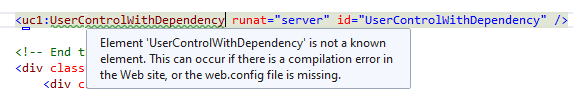
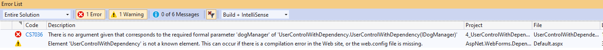

# PosInformatique.AspNet.WebForms.DependencyInjection
PosInformatique.AspNet.WebForms.DependencyInjection is a library to add the IoC container support of Microsoft.Extensions.DependencyInjection for ASP .NET Web Forms

## Installing from NuGet
The
[PosInformatique.AspNet.WebForms.DependencyInjection](https://www.nuget.org/packages/PosInformatique.AspNet.WebForms.DependencyInjection/)
is available directly on the
[NuGet](https://www.nuget.org/packages/PosInformatique.AspNet.WebForms.DependencyInjection/) official website.
To download and install the library to your Visual Studio project using the following NuGet command line 
```
Install-Package PosInformatique.AspNet.WebForms.DependencyInjection
```

## Setting up
After adding the
[PosInformatique.AspNet.WebForms.DependencyInjection](https://www.nuget.org/packages/PosInformatique.AspNet.WebForms.DependencyInjection/)
package on your ASP .NET
WebForms project call the `AddServiceCollection` the following lines in the ``Application_Start`` of your `HttpApplication` class in the
`Global.asax.cs` code behind:
```csharp
public class Global : HttpApplication
{
    protected void Application_Start(Object sender, EventArgs e)
    {
        ServicesConfig.RegisterServices(this.AddServiceCollection());

        // Code that runs on application startup
        RouteConfig.RegisterRoutes(RouteTable.Routes);
        BundleConfig.RegisterBundles(BundleTable.Bundles);
    }
}
```

In the `App_Start` folder add a new static class called `ServicesConfig` which allows to register
the services using the `Microsoft.Extensions.DependencyInjection.ServiceCollection`:
```csharp
namespace PosInformatique.AspNet.WebForms.DependencyInjection.IntegrationTests
{
    using System;
    using System.Collections.Generic;
    using System.Collections.ObjectModel;
    using System.Linq;
    using Microsoft.Extensions.DependencyInjection;

    public static class ServicesConfig
    {
        public static void RegisterServices(IServiceCollection serviceCollection)
        {
            serviceCollection.AddSingleton<IDogRepository, DogRepository>();
            serviceCollection.AddTransient<IDogManager, DogManager>();
        }
    }
}
```
You can register services with a *Transient* or *Singleton* scope. Unlike to ASP .NET Core,
[PosInformatique.AspNet.WebForms.DependencyInjection](https://www.nuget.org/packages/PosInformatique.AspNet.WebForms.DependencyInjection/)
does not support *Scoped* scope services
which exists during the HTTP request lifetime.

## Setting up using an existing IServiceProvider/IServiceCollection
If in your ASP .NET application you host the ASP .NET Core infrastructure (using the
[PosInformatique.AspNetCore.Server.AspNet](https://github.com/PosInformatique/PosInformatique.AspNetCore.Server.AspNet)
library for example), you can reuse the ``IServiceProvider`` and ``IServiceCollection``
internally builded by the ASP .NET Core infrastructure to share the same services
(and same singleton instances !) between your ASP .NET application and ASP .NET Core hosted application.

The following example, show how to reuse the internal ``IServiceProvider`` and ``IServiceCollection``
of ASP .NET Core application hosted in ASP .NET using the
[PosInformatique.AspNetCore.Server.AspNet](https://github.com/PosInformatique/PosInformatique.AspNetCore.Server.AspNet)
library:

```csharp
public class Global : System.Web.HttpApplication
{
    protected void Application_Start(object sender, EventArgs e)
    {
        var host = WebHost.CreateDefaultBuilder()
            .UseAspNet(options =>
            {
                options.Routes.Add("api");
                options.Routes.Add("swagger");
            })
            .ConfigureServices(services =>
            {
                // Add the default ASP .NET non-core services
                // in the IServiceCollection of ASP .NET core.
                services.AddDefaultAspNetServices(this);
            })
            .UseStartup<Startup>()
            .Start();

        // Reuse the built IServiceProvider of ASP .NET Core WebHost inside
        // the ASP .NET non-core infrastructure to use IoC feature.
        this.UseServiceProvider(host);
    }
}
```

The ``AddDefaultAspNetServices()`` method allows to add ASP .NET non-core infrastructure
service like the ``HttpRequest`` or ``HttpContext`` into the ``IServiceCollection`` which
will be available in the ``IServiceProvider`` built by the ASP .NET core infrastructure.

The ``UseServiceProvider()`` method allows to setup the ASP .NET non-core infrastructure
to use the implementation of ``IServiceProvider`` which is builted by the ``IWebHost``
of the ASP .NET Core infrastructure started.

With this approach the ASP .NET non-core and Core components will share the **same** service.
For example, if you register a ``IDogManager`` service as singleton in the services of ASP .NET Core,
the ``IDogManager`` service instance will be available and **the same instance**:
- In the constructors of the ASP .NET Web Forms pages, user controls,...
- In the constructors of the ASP .NET Core controllers
- And so on...

## Add the support of [ActivatorUtilitiesConstructor] attribute

By default, the
[Microsoft.Extensions.DependencyInjection](https://www.nuget.org/packages/Microsoft.Extensions.DependencyInjection/)
dependency injection container will use any
constructor which match the parameters of the control, or service to instantiate.
In the version **2.1** of
[Microsoft.Extensions.DependencyInjection](https://www.nuget.org/packages/Microsoft.Extensions.DependencyInjection/)
library, Microsoft has introduced a new
[ActivatorUtilitiesConstructorAttribute](https://docs.microsoft.com/en-us/dotnet/api/microsoft.extensions.dependencyinjection.activatorutilitiesconstructorattribute)
attribute which allows to force the `IServiceProvider` of the
[Microsoft.Extensions.DependencyInjection](https://www.nuget.org/packages/Microsoft.Extensions.DependencyInjection/)
library
to call explicitely the constructor decorated.

The version **1.2.0** of the
[PosInformatique.AspNet.WebForms.DependencyInjection](https://www.nuget.org/packages/PosInformatique.AspNet.WebForms.DependencyInjection/)
library add the support of the
[ActivatorUtilitiesConstructorAttribute](https://docs.microsoft.com/en-us/dotnet/api/microsoft.extensions.dependencyinjection.activatorutilitiesconstructorattribute)
attribute even technically this attribute is not added by the ASP .NET Compiler on the generated ASPX and ASCX views.

For example, imagine that you have the following user control:
````charp
public partial class UserControlWithDependency : System.Web.UI.UserControl
{
    private readonly IDogManager dogManager;

    [ActivatorUtilitiesConstructor]   // Will be call by the IServiceProvider of the Microsoft.Extensions.DependencyInjection library.
    public UserControlWithDependency(IDogManager dogManager)
    {
        this.dogManager = dogManager;
    }

    public UserControlWithDependency()
    {
    }
}
````

When the application is loaded the ASP .NET Compiler generate the following code which will not add the
[ActivatorUtilitiesConstructorAttribute](https://docs.microsoft.com/en-us/dotnet/api/microsoft.extensions.dependencyinjection.activatorutilitiesconstructorattribute)
attribute on the constructors associated:
````charp
public class usercontrolwithdependency_ascx : UserControlWithDependency
{
	...

	[DebuggerNonUserCode]
	public usercontrolwithdependency_ascx()
	{
		__Init();
	}

	[DebuggerNonUserCode]
	public usercontrolwithdependency_ascx(IDogManager dogManager)
		: base(dogManager)
	{
		__Init();
	}

    ...
}
````

The previous generated code can not be used correctly by the
[Microsoft.Extensions.DependencyInjection](https://www.nuget.org/packages/Microsoft.Extensions.DependencyInjection/)
library to call the right constructor based on the
[ActivatorUtilitiesConstructorAttribute](https://docs.microsoft.com/en-us/dotnet/api/microsoft.extensions.dependencyinjection.activatorutilitiesconstructorattribute).

In the version **1.2.0**, the
[PosInformatique.AspNet.WebForms.DependencyInjection](https://www.nuget.org/packages/PosInformatique.AspNet.WebForms.DependencyInjection/)
add the full support of the
[ActivatorUtilitiesConstructorAttribute](https://docs.microsoft.com/en-us/dotnet/api/microsoft.extensions.dependencyinjection.activatorutilitiesconstructorattribute)
by *virtually* add the attribute by reflection in the class generated by the ASP .NET Compiler.

## Issue in the ASPX/ASCX designer

When changing the constructor of the user controls and control to inject dependencies using the
[HttpRuntime.WebObjectActivator](https://docs.microsoft.com/fr-fr/dotnet/api/system.web.httpruntime.webobjectactivator),
the following message can appear when adding these controls to a page or other user controls:

> *Element 'xxxxx' is not a known element. This can occur if there is a compilation error in the Web site, or the web.config
file is missing*.



In this case, lot of *fakes* errors/warnings can be raised by Visual Studio (but the application can compile successfully).



Also, the IntelliSense for the ASPX code to edit the properties of the added controls does not work...

This is a
[known issue](https://developercommunity.visualstudio.com/content/problem/668468/user-control-fake-error-with-dependency-injection.html)
of Visual Studio and Microsoft seam to take *Under Consideration*...

There is workaround, which is provided with the
[PosInformatique.AspNet.WebForms.DependencyInjection](https://www.nuget.org/packages/PosInformatique.AspNet.WebForms.DependencyInjection/)
package by adding
a constructor without parameter in the control:

````csharp
public partial class UserControlWithDependency : System.Web.UI.UserControl
{
    private readonly IDogManager dogManager;

    [ActivatorUtilitiesConstructor]   // It is import to set this attribute to be sure this constructor will be called by the Microsoft.Extensions.DependencyInjection.
    public UserControlWithDependency(IDogManager dogManager)
    {
        this.dogManager = dogManager;
    }

    // Avoid the errors and the warnings in the Visual Studio ASPX code designer
    public UserControlWithDependency()
    {
    }

    protected void Page_Load(object sender, EventArgs e)
    {
        this.doggoList.DataSource = this.dogManager.GetDogs();
        this.doggoList.DataBind();
    }
}
````

> **Remarks**: You have also to add the [ActivatorUtilitiesConstructorAttribute](https://docs.microsoft.com/en-us/dotnet/api/microsoft.extensions.dependencyinjection.activatorutilitiesconstructorattribute)
on the constructor which requires the services registered in the
[Microsoft.Extensions.DependencyInjection](https://www.nuget.org/packages/Microsoft.Extensions.DependencyInjection/)
container.
Without this attribute, the constructor without parameter can be used during the execution of the application
with the default behavior of the
[Microsoft.Extensions.DependencyInjection](https://www.nuget.org/packages/Microsoft.Extensions.DependencyInjection/).

## Contributions
Do not hesitate to clone my code and submit some changes...
It is a open source project, so everyone is welcome to improve this library...
By the way, I am french... So maybe you will remarks that my english is not really fluent...
So do not hesitate to fix my resources strings or my documentation... Merci !

## Thanks
I want to thank the [DiliTrust](https://www.dilitrust.com/) company to test and gave me their
feedback of this library for their ASP .NET WebForms applications.